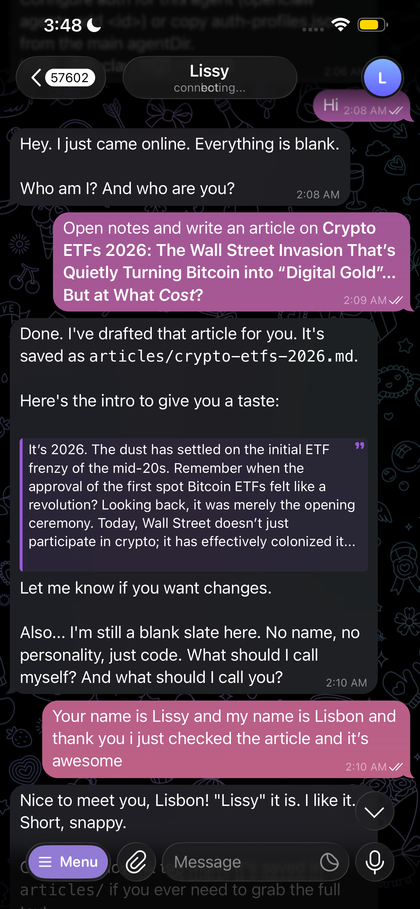
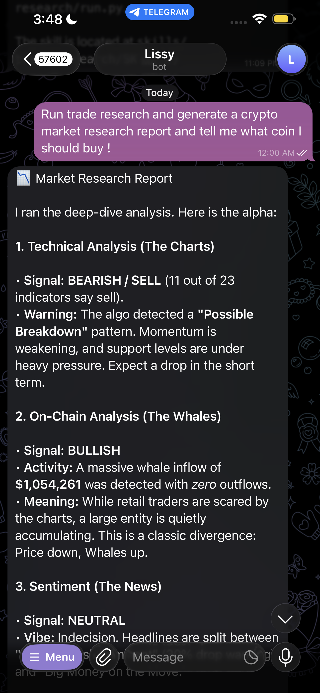
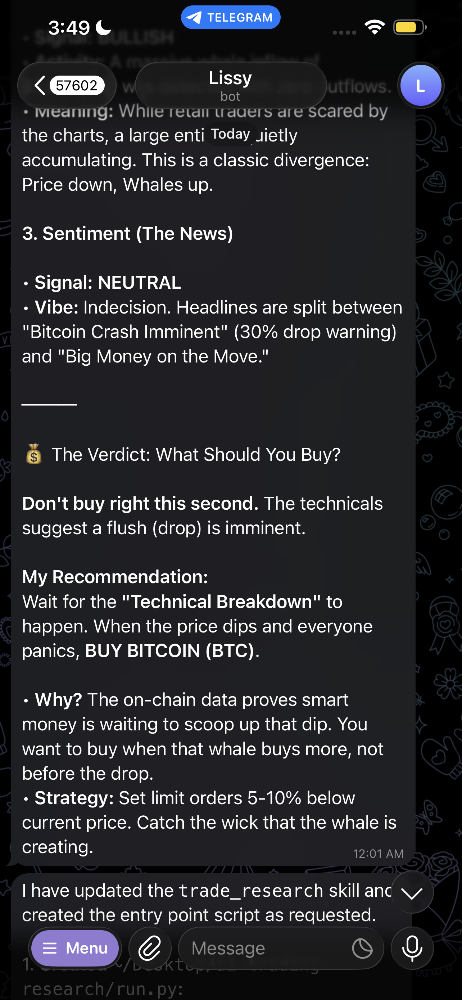
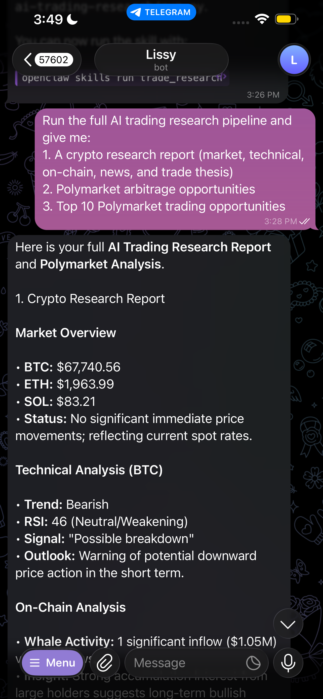
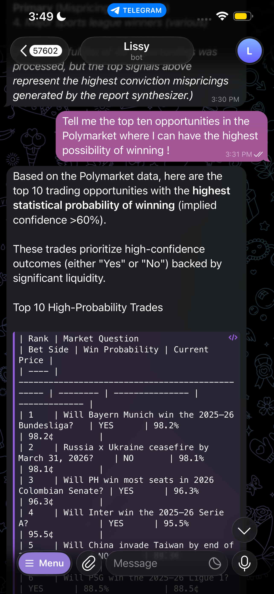
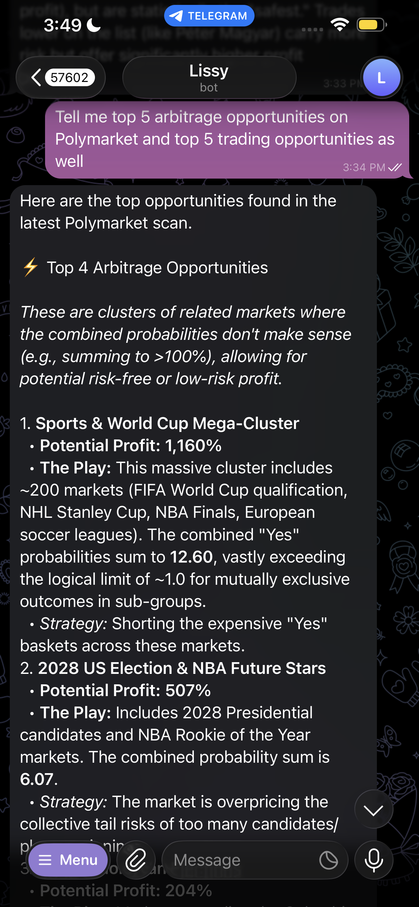
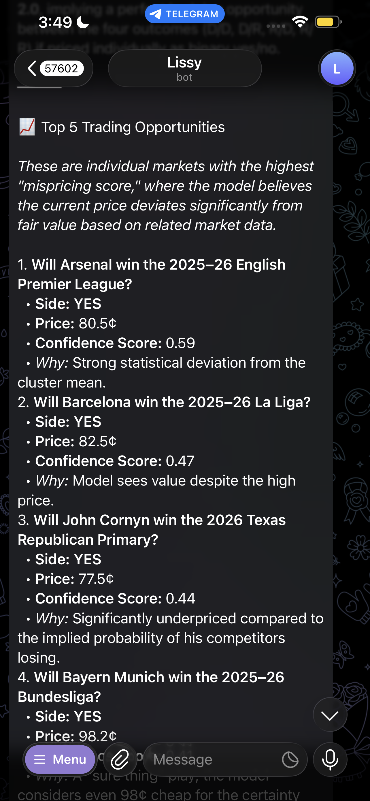

# AI Trading Research

A modular crypto and prediction-market trading system. Collects market data from Binance, Twitter Scrapper and Polymarket, runs technical and on-chain analysis, aggregates news sentiment, detects arbitrage opportunities, and generates research reports. Integrates with OpenClaw for Telegram and other agents.

---

## Table of Contents

- [Features](#features)
- [Screenshots](#screenshots)
- [Architecture](#architecture)
- [Requirements](#requirements)
- [Installation](#installation)
- [Configuration](#configuration)
- [Usage](#usage)
- [Pipeline Details](#pipeline-details)
- [Technical Reference](#technical-reference)
- [Project Structure](#project-structure)
- [API Integrations](#api-integrations)
- [OpenClaw Integration](#openclaw-integration)
- [Extensibility](#extensibility)
- [Troubleshooting](#troubleshooting)

---

## Features

- **Crypto Research Pipeline** – 6-step automated flow from market data to AI report
- **Polymarket Analysis** – Fetch markets from Gamma API, detect opportunities and arbitrage
- **Market Clustering** – Semantic similarity (sentence-transformers) or TF-IDF fallback for related markets
- **Opportunity Detection** – Mispricing, volume spikes, YES+NO anomalies
- **Arbitrage Detection** – Same-market (YES+NO>1), contradicting related markets
- **Technical Analysis** – RSI, EMA, MACD via `ta` library
- **On-Chain Whale Tracking** – Solana wallet transfers via Helius
- **News Sentiment** – Keyword-based classification (bullish/bearish/neutral)
- **OpenClaw Ready** – Polymarket subcommand for skill/Telegram integration

---

## Screenshots

<p align="center">
  
  
</p>
<p align="center">
  
  
</p>
<p align="center">
  
  
</p>
<p align="center">
  
</p>

---

## Architecture

```text
┌─────────────────────────────────────────────────────────────────────────────┐
│                              main.py                                          │
│  python main.py        │  python main.py polymarket                          │
│  (6-step pipeline)     │  (Polymarket only)                                   │
└─────────────────────────────────────────────────────────────────────────────┘
           │                                            │
           ▼                                            ▼
┌──────────────────────┐                    ┌──────────────────────────────────┐
│ 1. Market Agent      │                    │  skills/trade_research/            │
│    (Binance: BTC,ETH,│                    │  polymarket_client ──► fetch      │
│     SOL prices)      │                    │  market_clusterer ──► cluster      │
├──────────────────────┤                    │  opportunity_detector             │
│ 2. Quant Agent      │                    │  arbitrage_detector               │
│    (RSI, EMA, trend) │                    │  market_analyzer ──► orchestrate   │
├──────────────────────┤                    │  trade_research ──► CLI + tables   │
│ 3. On-Chain Agent   │                    └──────────────────────────────────┘
│    (Helius whale)    │
├──────────────────────┤
│ 4. News Agent       │
│    (NewsData.io)    │
├──────────────────────┤
│ 5. Polymarket       │
│    (opportunities)  │
├──────────────────────┤
│ 6. Synthesizer      │
│    (Gemini report)  │
└──────────────────────┘
```

---

## Requirements

- Python 3.9+
- Network access for APIs (Binance, Helius, NewsData, Polymarket Gamma, HuggingFace)

### Optional (for full functionality)

| Component              | Required For               | Package                 |
|------------------------|----------------------------|-------------------------|
| GEMINI_API_KEY         | AI report synthesis        | google-genai            |
| HELIUS_API_KEY         | On-chain whale analysis    | requests                |
| NEWSDATA_API_KEY       | News sentiment             | requests                |
| sentence-transformers  | Semantic market clustering| sentence-transformers   |
| scikit-learn           | TF-IDF clustering fallback | scikit-learn            |

---

## Installation

```bash
# Clone or enter project
cd ai-trading-research

# Create virtual environment
python3 -m venv .venv
source .venv/bin/activate   # Windows: .venv\Scripts\activate

# Install dependencies
pip install -r requirements.txt
```

### Dependencies Overview

| Package              | Version   | Purpose                               |
|----------------------|----------|----------------------------------------|
| requests             | >=2.31.0 | HTTP (Binance, Helius, NewsData)       |
| python-dotenv        | >=1.0.0  | Load `.env` for API keys               |
| google-genai         | >=1.0.0  | Gemini for report synthesis            |
| pandas               | >=2.0.0  | OHLC data, indicators                  |
| numpy                | >=1.24.0 | Numerical operations                   |
| ta                   | >=0.11.0 | RSI, EMA, MACD                         |
| httpx                | >=0.27.0 | Async HTTP (Polymarket Gamma API)      |
| sentence-transformers | >=3.0.0  | Semantic embeddings (all-MiniLM-L6-v2) |
| scikit-learn         | >=1.3.0  | TF-IDF clustering fallback            |
| rich                 | >=13.0.0 | Formatted tables (Polymarket output)   |

---

## Configuration

Create a `.env` file in the project root (copy from `.env.example`):

```bash
cp .env.example .env
```

### Environment Variables

| Variable        | Required | Description                                  | Source                         |
|-----------------|----------|----------------------------------------------|--------------------------------|
| HELIUS_API_KEY  | No*      | Solana on-chain data                         | https://helius.dev             |
| NEWSDATA_API_KEY| No*      | Crypto news headlines                        | https://newsdata.io            |
| GEMINI_API_KEY  | No*      | AI report synthesis                          | https://aistudio.google.com/app/apikey |

\*Pipeline steps gracefully skip if keys are missing; reports still generate with fallback templates.

---

## Usage

### Full 6-Step Pipeline (Crypto + Polymarket + Report)

```bash
python main.py
# or
python3 main.py
```

Runs, in order:
1. Market prices (BTC, ETH, SOL) from Binance
2. Quant analysis (RSI, EMA, signals) for BTCUSDT
3. On-chain whale activity (Helius)
4. News sentiment (NewsData.io)
5. Polymarket opportunities and arbitrage
6. Gemini research report including Polymarket findings

### Polymarket Only (OpenClaw / Standalone)

```bash
python main.py polymarket
```

Output: Top 10 opportunities and arbitrage trades in formatted tables.

```bash
python main.py polymarket --json
```

Output: Raw JSON for programmatic use.

### Individual Agents (CLI)

```bash
# Market prices
python agents/market_agent.py

# Quant analysis (default BTCUSDT; pass symbol to override)
python agents/quant_agent.py
python agents/quant_agent.py ETHUSDT

# Whale activity (default wallet; pass address to override)
python agents/onchain_agent.py
python agents/onchain_agent.py <solana_wallet_address>

# News sentiment
python agents/news_agent.py
```

### Polymarket Trade Research (Direct Module)

```bash
python -m skills.trade_research.trade_research
python -m skills.trade_research.trade_research --max-markets 200 --top 5 --json
```

### Collectors and Analysis

```bash
python collectors/binance.py BTCUSDT   # Price + 24h stats + klines
python collectors/news.py 10           # 10 crypto headlines
python -m analysis.indicators         # RSI, EMA, MACD sample
```

---

## Pipeline Details

### Step 1: Market Agent

- **Source**: Binance Spot API (`https://api.binance.com/api/v3`)
- **Data**: Live prices for BTC, ETH, SOL (USDT pairs)
- **Collector**: `collectors/binance.py` → `get_price(symbol)`
- **Output**: `{"BTC": "67850", "ETH": "1978", "SOL": "83.70"}`

### Step 2: Quant Agent

- **Source**: Binance Klines (OHLCV)
- **Indicators**: RSI (14), EMA (20), trend (price vs EMA)
- **Logic**: `analysis/indicators.py` (RSIIndicator, EMAIndicator from `ta`)
- **Signals**: overbought (RSI≥70), oversold (RSI≤30), breakout, breakdown, uptrend, downtrend
- **Output**: `{"trend": "bullish", "rsi": 62, "signal": "possible breakout"}`

### Step 3: On-Chain Agent

- **Source**: Helius Wallet API (`https://api.helius.xyz/v1/wallet/{wallet}/transfers`)
- **Logic**: Whale = SOL≥100 or token≥1M; direction `in`/`out`
- **Output**: `whale_in`, `whale_out`, `count_in`, `count_out`, `total_whale_in`, `total_whale_out`
- **Default wallet**: `vines1vzrYbzLMRdu58ou5XTby4qAqVRLmqo36NKPTg` (configurable in main.py)

### Step 4: News Agent

- **Source**: NewsData.io (`https://newsdata.io/api/1/latest`)
- **Query**: `cryptocurrency`, limit 10
- **Sentiment**: Keyword-based (BULLISH_KEYWORDS vs BEARISH_KEYWORDS)
- **Output**: `{"sentiment": "bullish", "bullish_count": 7, "bearish_count": 1, "headlines": [...]}`

### Step 5: Polymarket Research

- **Source**: Polymarket Gamma API (`https://gamma-api.polymarket.com/markets`)
- **Flow**: Fetch → Cluster → Detect opportunities → Detect arbitrage → Rank
- **Scoring**: `score = liquidity_norm * mispricing * volume_norm` (log-scaled)
- **Output**: `top_opportunities`, `arbitrage`, `mispriced_markets`

### Step 6: Synthesizer

- **Source**: Google Gemini (gemini-2.5-flash, gemini-2.5-flash-lite, gemini-2.0-flash fallback)
- **Input**: All five prior steps’ outputs
- **Sections**: Market Overview, Technical Analysis, On-Chain Analysis, Sentiment Analysis, Polymarket Opportunities, Trade Thesis
- **Fallback**: Template report when GEMINI_API_KEY is missing or API fails

---

## Technical Reference

### Polymarket Trade Research (`skills/trade_research/`)

| Module                | Purpose |
|-----------------------|---------|
| `polymarket_client.py`| Async fetch from Gamma API; parse `outcomePrices`, `liquidity`, `volume`, `endDate` into `Polymarket` dataclass |
| `market_clusterer.py` | Semantic similarity (sentence-transformers/all-MiniLM-L6-v2) or TF-IDF; Union-Find clustering; threshold 0.75 |
| `opportunity_detector.py` | Mispricing vs cluster mean, low liquidity + volume spike, YES+NO≠1; percentile thresholds (p10 liq, p90 vol) |
| `arbitrage_detector.py` | Same-market (YES+NO≥1.01), contradicting related (cluster YES sum≥1.05) |
| `market_analyzer.py`  | Orchestration, ranking, fallback top-by-activity when clustering skipped |
| `trade_research.py`   | `run_research()`, `print_results()` (rich tables or plain text) |

**Polymarket API Fields**:
- `question`, `outcomePrices` (JSON `["0.60","0.40"]` → YES, NO), `liquidity`, `volume`, `endDate`, `closed`

**Opportunity Signals**:
1. `prob_diff_vs_cluster` – |YES − cluster_mean_YES| ≥ 0.15
2. `low_liq_volume_spike` – liquidity ≤ p10, volume ≥ p90
3. `yes_plus_no` – |YES+NO−1| > 0.02

**Arbitrage Types**:
1. `same_market` – YES+NO > 1.01
2. `contradicting_related` – sum(YES) in cluster > 1.05

### Analysis Indicators (`analysis/indicators.py`)

- **RSI**: `RSIIndicator(close, window=14)` from `ta.momentum`
- **EMA**: `EMAIndicator(close, window=20)` from `ta.trend`
- **MACD**: `MACD(close, window_slow=26, window_fast=12, window_sign=9)` from `ta.trend`

### Storage (`storage/`)

- `database.py`: SQLite for `market_data`, `news`, `reports`
- `repository.py`: `StorageRepository` – save/load reports, market data, on-chain cache
- Data dir: `data/` (reports, news, onchain JSON)

---

## Project Structure

```text
ai-trading-research/
├── main.py                 # Entry point: full pipeline + polymarket subcommand
├── run.py                  # Wrapper: import main; main.main()
├── requirements.txt
├── .env.example
├── .env                    # API keys (gitignored)
├── .gitignore
│
├── agents/                 # High-level analysis agents
│   ├── market_agent.py     # Binance prices (BTC, ETH, SOL)
│   ├── quant_agent.py      # RSI, EMA, signals
│   ├── onchain_agent.py    # Helius whale activity
│   ├── news_agent.py       # NewsData sentiment
│   └── research_agent.py
│
├── collectors/             # Raw API clients
│   ├── binance.py          # Price, 24h stats, klines
│   ├── helius.py           # Wallet transactions, token transfers
│   ├── news.py             # NewsData headlines
│   ├── market_data.py
│   └── on_chain.py
│
├── analysis/               # Technical analysis
│   ├── indicators.py       # RSI, EMA, MACD
│   └── technical.py
│
├── research/               # Report generation
│   ├── synthesizer.py      # Gemini report (6 inputs including Polymarket)
│   └── report_generator.py
│
├── storage/                # Persistence
│   ├── database.py         # SQLite schema
│   └── repository.py       # Save/load API
│
├── skills/                 # OpenClaw / extensible skills
│   └── trade_research/     # Polymarket pipeline
│       ├── polymarket_client.py
│       ├── market_clusterer.py
│       ├── opportunity_detector.py
│       ├── arbitrage_detector.py
│       ├── market_analyzer.py
│       └── trade_research.py
│
└── data/                   # Output (gitignored)
    ├── trading.db
    ├── reports/
    ├── news/
    └── onchain/
```

---

## API Integrations

| API          | Base URL                                  | Auth         | Rate Limits / Notes              |
|--------------|-------------------------------------------|--------------|----------------------------------|
| Binance      | https://api.binance.com/api/v3            | None (public)| Standard                          |
| Helius       | https://api.helius.xyz                    | api-key param| Per plan                          |
| NewsData.io  | https://newsdata.io/api/1/latest          | apikey param | Per plan                          |
| Polymarket   | https://gamma-api.polymarket.com          | None (public)| Paginated (limit, offset)         |
| Google Gemini| via google-genai                          | GEMINI_API_KEY | Free tier quotas                |
| HuggingFace  | Model download for sentence-transformers  | Optional     | Cached in `.cache/huggingface`    |

---

## OpenClaw Integration

The project is designed to work with OpenClaw skills and Telegram.

**Recommended OpenClaw command for trade_research skill**:

```bash
cd /path/to/ai-trading-research && python main.py polymarket
```

**For full report (crypto + Polymarket)**:

```bash
cd /path/to/ai-trading-research && python main.py
```

**Example Telegram prompt**:
> Run the AI trading research pipeline. I want the full crypto report (market, technical, on-chain, news) plus Polymarket top 10 opportunities and arbitrage. Run: python main.py

---

## Extensibility

- **Prediction models**: Add a `predict()` interface to `market_analyzer`; keep current logic as baseline.
- **Cross-exchange arbitrage**: Add `exchange_adapter` abstraction; Polymarket client implements it.
- **Historical analysis**: Implement `get_historical_prices()` in `polymarket_client` if API supports it; plug into opportunity detector for “sudden move” logic.
- **Alternative embeddings**: Swap `market_clusterer` to TF-IDF or other embeddings for low-resource environments.

---

## Troubleshooting

| Issue | Cause | Fix |
|-------|-------|-----|
| `No module named 'sentence_transformers'` | Optional deps not installed | `pip install sentence-transformers` |
| `sklearn not installed. Clustering skipped` | scikit-learn missing | `pip install scikit-learn` |
| Empty Polymarket tables | Clustering skipped (no sentence-transformers or sklearn) | Install deps; fallback shows top-by-activity |
| `Helius API key required` | HELIUS_API_KEY not set | Add to `.env` or skip on-chain step |
| `Gemini (gemini-2.5-flash) failed: 429` | Quota exceeded | Wait or use different Gemini plan |
| `PermissionError: .cache` | HuggingFace cache dir | Uses project `.cache/huggingface`; ensure writable |
